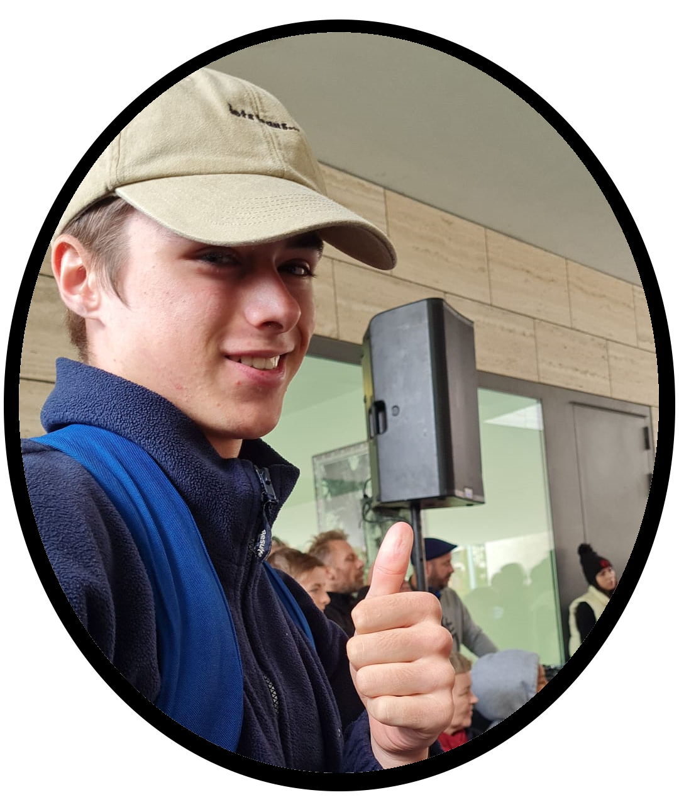

    
    <h1>Wout Paepen</h1>

## About me 🙋‍♂️
- 🏫 I'm 20 years old
- 🏠 I live in Belgium 🇧🇪
- 📚 I'm studying Applied Computer Science
- 🎓 I'm a student at Uc Leuven-Limburg
- 🌱 I’m currently learning Java, Python, HTML, CSS, JavaScript, SQL, ...

## Languages and Tools 🛠️

<a href="https://www.java.com/">

## Stats 📊

## Fun fact ⚡
- 🎢 I love Theme Parks
- 🎮 I love playing games
- 🏂 I love snowboarding

<!--
**WoutPaepenUcLL/WoutPaepenUcLL** is a ✨ _special_ ✨ repository because its `README.md` (this file) appears on your GitHub profile.

Here are some ideas to get you started:

- 🔭 I’m currently working on ...
- 🌱 I’m currently learning ...
- 👯 I’m looking to collaborate on ...
- 🤔 I’m looking for help with ...
- 💬 Ask me about ...
- 📫 How to reach me: ...
- 😄 Pronouns: ...
- ⚡ Fun fact: ...
-->
